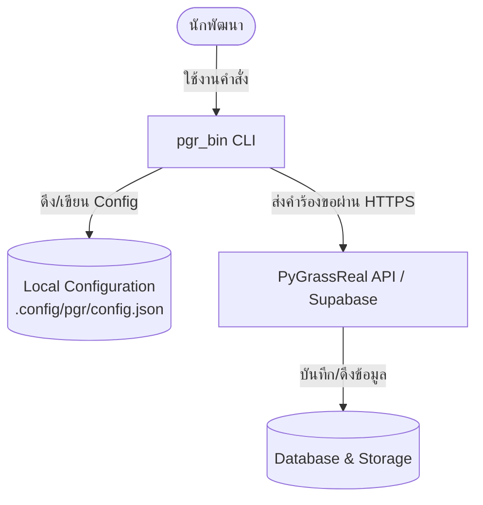

# แผนการพัฒนา PyGrassReal CLI (`pgr_bin`)

เอกสารนี้ระบุแผนงาน โครงสร้าง และรายละเอียดสถาปัตยกรรมในการพัฒนาเครื่องมือ Command Line Interface (CLI) ของแพลตฟอร์ม **PyGrassReal** ภายใต้ชื่อคำสั่ง **`pgr_bin`** ซึ่งจะถูกเผยแพร่ในรูปแบบของ npm package เพื่อช่วยให้นักพัฒนาสามารถจัดการโค้ด พารามิเตอร์ และการเผยแพร่โมเดล Parametric Grass ได้โดยตรงจาก Terminal

---

## 1. เป้าหมายของโปรเจกต์ (Project Goals)
- **Developer Experience**: ช่วยให้นักพัฒนาที่เขียน Parametric Grass (เช่น Rhino/Grasshopper, Python-based parametric models) สามารถอัปโหลดและทดสอบผลงานบนแพลตฟอร์ม PyGrassReal ได้รวดเร็วยิ่งขึ้น
- **Automation / CI-CD**: รองรับการนำไปใช้ใน pipeline การทำ CI/CD เพื่ออัปเดตโมเดลพารามิเตอร์โดยอัตโนมัติเมื่อมีการ push โค้ดไปยังระบบเวอร์ชันคอนโทรล (เช่น GitHub)
- **Local Development Integration**: เชื่อมต่อ Workspace ในเครื่องของนักพัฒนากับระบบ Cloud/Database ของ PyGrassReal ได้อย่างไร้รอยต่อ

---

## 2. เครื่องมือและสแต็กเทคโนโลยี (Tech Stack)
เนื่องจากเป็น CLI ที่วางแผนพัฒนาในรูปแบบ npm package จึงเลือกใช้สแต็กที่เป็นมิตรต่อนักพัฒนา JavaScript/TypeScript ดังนี้:

- **Language**: TypeScript ( compile เป็น JavaScript ES Modules / CommonJS )
- **Command Parser**: `commander.js` (สำหรับจัดการคำสั่ง, options และ help menu)
- **Interactive UI**: `inquirer` หรือ `prompts` (สำหรับรับข้อมูลจากผู้ใช้ผ่านคำถามแบบ Interactive)
- **Visuals & Styling**: 
  - `chalk` สำหรับแสดงผลสีสันบน terminal
  - `ora` สำหรับ animation spinner ระหว่างประมวลผล (เช่น ตอนอัปโหลด)
  - `boxen` สำหรับตีกรอบข้อความสำคัญ
- **HTTP Client**: `axios` หรือ native `fetch` (สำหรับติดต่อกับ Backend API และ Supabase)
- **Config Management**: `conf` สำหรับบันทึกข้อมูลการเชื่อมต่อและ Token ในเครื่องผู้ใช้ (Local Config)

---

## 3. สถาปัตยกรรมการทำงาน (Architecture)



---

## 4. โครงสร้างโฟลเดอร์ของโปรเจกต์ (Proposed Directory Structure)

แนะนำให้สร้างโปรเจกต์แยก หรือเป็นโฟลเดอร์ย่อยในระบบที่มีโครงสร้างดังนี้:

```text
CLI_PGR/
├── bin/
│   └── pgr_bin                 # Executable script (shebang file)
├── src/
│   ├── index.ts                # Entry point หลักของ CLI
│   ├── commands/               # เก็บ logic ของแต่ละคำสั่งแยกกัน
│   │   ├── auth.ts             # login, logout, whoami
│   │   ├── init.ts             # สร้างไฟล์ตั้งค่าเริ่มต้น (pygrass.config.json)
│   │   ├── publish.ts          # อัปโหลดโมเดลและพารามิเตอร์ขึ้น Cloud
│   │   └── status.ts           # ตรวจสอบสถานะการเชื่อมต่อและโปรเจกต์
│   ├── services/               # ส่วนเชื่อมต่อภายนอก
│   │   ├── api.ts              # API client ติดต่อ Supabase/Backend
│   │   └── config.ts           # จัดการ Local config (Token, Session)
│   └── utils/                  # ฟังก์ชันตัวช่วยทั่วไป (validation, formatting)
├── package.json
└── tsconfig.json
```

---

## 5. คำสั่งหลักที่ต้องพัฒนา (Core CLI Commands)

### 5.1 `pgr_bin login`
* **คำอธิบาย**: ใช้สำหรับเชื่อมโยง Terminal เข้ากับบัญชี PyGrassReal ของผู้ใช้
* **การทำงาน**:
  1. เปิดเบราว์เซอร์ไปที่หน้าเว็บแดชบอร์ดเพื่อให้ผู้ใช้ก๊อปปี้ API Key/Access Token
  2. หรือให้กรอก Email/Password ผ่าน prompt (หาก backend รองรับ)
  3. บันทึก Token ลงในระบบจัดเก็บข้อมูลภายในเครื่อง (`~/.config/pgr-cli/config.json`)

### 5.2 `pgr_bin init`
* **คำอธิบาย**: สร้างไฟล์กำหนดค่าเริ่มต้นภายในโฟลเดอร์งานปัจจุบัน
* **การทำงาน**:
  - สร้างไฟล์ `pygrass.config.json` ซึ่งเก็บข้อมูลเมทาดาตาของโมเดล เช่น:
    ```json
    {
      "projectId": "proj_abc123",
      "name": "My Parametric Grass Model",
      "version": "1.0.0",
      "entryFile": "./main.py",
      "parameters": "./parameters.json"
    }
    ```

### 5.3 `pgr_bin status`
* **คำอธิบาย**: ตรวจสอบสถานะการเชื่อมต่อ และเปรียบเทียบความแตกต่างระหว่างไฟล์ในเครื่องกับบน Cloud
* **การทำงาน**:
  - ดึงข้อมูลจาก backend เพื่อตรวจสอบว่าโปรเจกต์ใน `pygrass.config.json` มีอยู่จริงและเป็นเวอร์ชันใด

### 5.4 `pgr_bin publish`
* **คำอธิบาย**: บีบอัดโค้ด วิเคราะห์พารามิเตอร์ และอัปโหลดไฟล์ขึ้นสู่คลาวด์ของ PyGrassReal
* **การทำงาน**:
  1. ตรวจสอบความถูกต้องของไฟล์ตามที่กำหนดใน Config
  2. ดึงข้อมูลพารามิเตอร์ (Parameters Schema) ของโมเดล
  3. ทำการ Zip หรือส่งไฟล์ไปยัง Supabase Storage / Edge Function ของระบบ
  4. ทำการ Sync ข้อมูลเข้ากับ Database เพื่อแสดงผลบนหน้าจอ Dashboard

### 5.5 `pgr_bin logout`
* **คำอธิบาย**: ลบ Token การเข้าสู่ระบบออกจากเครื่องโลคอลอย่างปลอดภัย

---

## 6. แผนการดำเนินงาน (Roadmap)

| ระยะการพัฒนา (Phase) | รายละเอียดงาน | ผลลัพธ์ที่ได้ (Deliverables) |
| :--- | :--- | :--- |
| **Phase 1: Setup & Authentication** | - ตั้งค่าโปรเจกต์ TypeScript CLI<br>- พัฒนาคำสั่ง `login`, `logout` และระบบจัดการ Local Session | สามารถล็อกอินและเก็บข้อมูล Session ภายในเครื่องได้อย่างปลอดภัย |
| **Phase 2: Project Initialization** | - พัฒนาคำสั่ง `init` เพื่อสร้างไฟล์กำหนดค่าและทำ interactive setup<br>- กำหนดมาตรฐานโครงสร้าง `pygrass.config.json` | มีระบบ config template สำหรับระบุ metadata ของ Parametric model |
| **Phase 3: Core Upload & Synchronization** | - พัฒนาคำสั่ง `publish` เชื่อมโยงกับ Backend API<br>- เขียน Logic การอัปโหลดไฟล์และอัปเดตสถานะใน Database | นักพัฒนาสามารถอัปเดตโมเดลจากเครื่องคอมพิวเตอร์ขึ้นระบบคลาวด์ได้ผ่าน CLI |
| **Phase 4: Release & CI/CD Docs** | - เผยแพร่แพ็กเกจขึ้น **npm registry** เพื่อให้ดาวน์โหลดผ่าน `npm install -g pgr-cli`<br>- ทำคู่มือการใช้ CLI ใน GitHub Actions | นักพัฒนาสามารถทำ automation workflow (เช่น ทุกครั้งที่ git push ให้ auto-publish) |

---
> [!TIP]
> ในการพัฒนาเบื้องต้น เราควรใช้ **Supabase Client JS** ร่วมกับ Edge Functions ของ Supabase เพื่อรองรับการอัปโหลดไฟล์ขนาดใหญ่และความปลอดภัยในการทำ Auth ของนักพัฒนา
